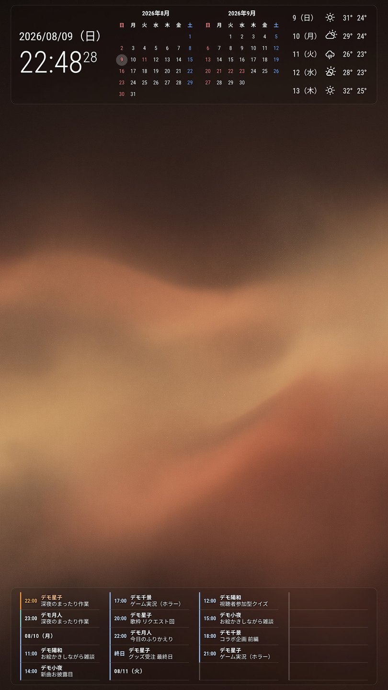
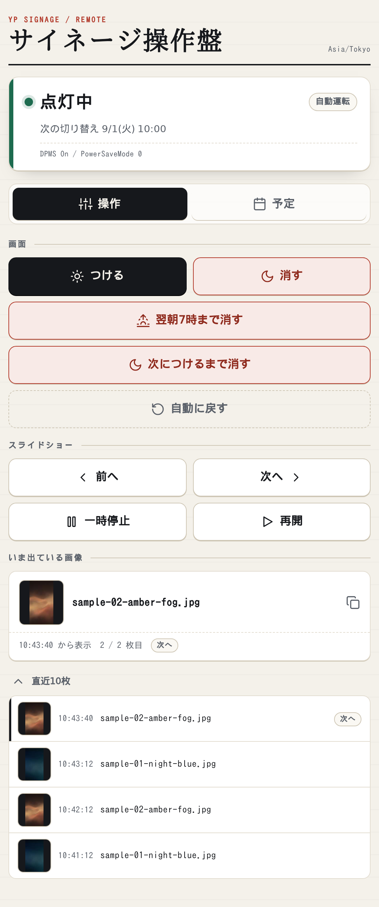
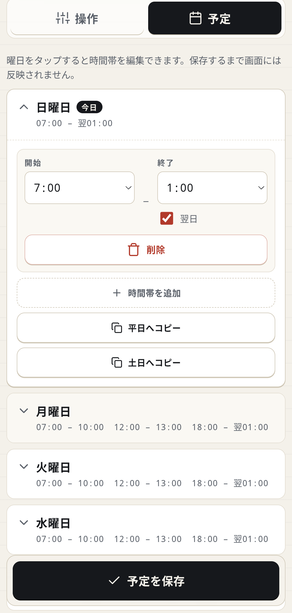

> 最終更新: 2026-08-24（Mon）

# yp-signage

縦置きの外部モニターに、時計、月間カレンダー、天気、背景スライドショー、推しの配信予定をまとめて表示するサイネージです。
[MagicMirror²](https://github.com/MagicMirrorOrg/MagicMirror) の設定と自作モジュールで構成しています。

このリポジトリにMagicMirror²本体は含まれていません。
先に本体を導入し、その上へ設定と自作モジュールを配布して使います。



上の画像は実機（縦 1080×1920）をデモモードで撮影したものです。
背景と予定はすべて同梱のサンプルデータで、`SIGNAGE_DEMO=true` を付けて起動すれば同じ画面が出ます。

使っていないノートPCと外部モニターを活用し、時計やカレンダーと一緒に推しの配信予定を常時表示したい、というところから作り始めました。
配信予定は、自作のWebサービスである[推しスケ](https://github.com/YoyogiPinball/oshi-sche-webapp)からiCalendar形式で受け取ります。

## 何ができるか

画面は、背景、上部の情報欄、下部の予定欄という3層で構成します。

- **背景**：手元の画像フォルダを再帰的に読み取り、60秒ごとにフェードで切り替えます。表示順と、最後の画像まで進んだあとの動作を選べます
- **上部**：時計、今月と来月のカレンダー、5日分の天気予報を表示します。カレンダーには祝日と振替休日も表示します
- **下部**：iCalendarで購読した今後の予定を、開始時刻のそろった2段のカードで表示します
- **画面タイマーとリモコン**：曜日ごとの予定に合わせて外部モニターを点灯または消灯し、ブラウザから画面とスライドショーを操作できます

下バーの予定は、配信開始時刻になるとその枠だけがふわっと点滅します。
画面を覆う通知は出しません。
視界の端に置く画面なので、視線を奪わずに気づける見せ方にしています。

## 動作環境

**以下の構成でのみ検証しています。** 横画面やRaspberry Pi 等での動作は未確認です。

| 項目 | 検証している構成 |
|---|---|
| 表示機 | ThinkPad X13 Gen1 |
| OS | Ubuntu 26.04 / GNOME (Wayland) + XWayland |
| Node.js | 24（MagicMirror² v2.37 が要求するバージョンに従う） |
| MagicMirror² | v2.37 を `~/MagicMirror/` に導入済み |
| モニター | HDMI接続した外部モニターを縦置き（1080×1920） |
| 操作元 | 別マシン（WSL）から ssh・scp で配る |

解像度は `.env` の 1 行で変更できます。横画面で試したい場合はそこから変えるのが早いです。

> **Note:** 表示機と操作元を分けていますが、同じ機械で完結させても構いません。その場合は
> `deploy.sh` を使わず、下の「配布先の対応表」のとおりに手でコピーしてください。

すでに動かしているものを更新する場合は、先に [CHANGELOG.md](./CHANGELOG.md) を読んでください。
何が変わったかと、`.env` の書き換えが要るかどうかを書いてあります。

## 導入

### 1. MagicMirror² 本体を入れる

[本家の手順](https://docs.magicmirror.builders/getting-started/installation.html) に従って
表示機の `~/MagicMirror/` に導入し、素の状態で画面が出るところまで先に確認してください。
ここが動かないうちに設定を重ねると、切り分けが難しくなります。

### 2. このリポジトリを取得する

操作元のマシンに clone します（表示機ではありません）。

```bash
git clone https://github.com/YoyogiPinball/yp-signage.git
cd yp-signage
```

### 3. 配布先を決める

`deploy.sh` と `sync-images.sh` は、どの機械へ配るかを `signage.conf` から読みます。
このファイルは `.gitignore` 済みで、ホスト名や手元のフォルダ構成がリポジトリに入らないようにしてあります。

```bash
cp signage.conf.example signage.conf
$EDITOR signage.conf     # SIGNAGE_HOST_DEFAULT に ssh の設定名を書く
```

`~/.ssh/config` の `Host` 名を書いてください。鍵認証を通しておく必要があります。
その場限りで変えたいときは `SIGNAGE_HOST=別の名前 ./deploy.sh` でも渡せます（こちらが優先されます）。

> **Note:** これ以降の例では、SSH Host 名を `signage` と決めたものとして書いています。
> 別の名前にした場合は `ssh signage …` の `signage` を読み替えてください。
> `./deploy.sh` と `./sync-images.sh` は `signage.conf` を読むので、読み替えは不要です。

### 4. まず動かしてみる（デモモード）

自分の画像も iCal も用意しないまま、完成した画面を先に確認できます。**通信は一切しません。**

```bash
cp magicmirror/.env.example magicmirror/.env
sed -i 's/^SIGNAGE_DEMO=false/SIGNAGE_DEMO=true/' magicmirror/.env
```

この状態のまま手順 7〜9（配る → 権限修正 → 起動）まで進めると、背景は同梱のサンプル画像、
配信予定はダミーデータが並び、天気は API キー不要のデモ用パネルに差し替わった画面が出ます。
「入れたのに何も出ない」で詰まる前に、動いている状態を見ておくためのものです。

見終わったら `magicmirror/.env` の `SIGNAGE_DEMO` を `false` に戻し、もう一度配って起動し直してください。

> **Tip:** ファイルを書き換えずに 1 回だけ試すこともできます。
> `ssh signage 'SIGNAGE_DEMO=true bash ~/run/mm-start.sh'` で起動すれば、その回だけデモになります。

### 5. 背景画像を置く

画像が 1 枚も無いと、画面には「画像なし」という文字だけが出ます。正常な動作ですが
壊れて見えるので、最初にダミーを置いておいてください（デモモードの間はこの手順は不要です）。

```bash
ssh signage 'mkdir -p ~/signage/slides'
scp samples/*.jpg signage:~/signage/slides/
```

`~/signage/slides/` の下にはフォルダを作ることもでき、再帰的にすべて拾って 1 本の再生リストにまとめます。

### 6. .env を書く

秘密情報（iCal URL・API キー）と、環境ごとに変わる値（解像度・表示秒数・緯度経度）は
`.env` にまとめてあります。`config.js`（150 行の JavaScript）を開かずに設定を変えるためです。

手順 4 で作った `magicmirror/.env` をそのまま編集してください（まだ作っていなければ
`cp magicmirror/.env.example magicmirror/.env` から）。

```bash
$EDITOR magicmirror/.env
```

書式は `KEY=値` だけで、引用符もカンマも要りません。1 行書き損じてもその項目が既定値に落ちるだけで、
他の設定は生き残ります。項目の一覧と意味は `.env.example` のコメントにすべて書いてあります。

全部空のままでも起動します。その場合、カレンダーと天気のパネルが出ない画面になります。

> **Warning:** 配布先での置き場所は `~/MagicMirror/.env` で、`config/` ではなく
> **MagicMirror のルート**です。`config.js` は引数なしの `process.loadEnvFile()` で
> 「カレントディレクトリの `.env`」を読み、MagicMirror は自身のルートをカレントディレクトリにして
> 起動します。`config/` に置くと、エラーも出さずに全項目が既定値へ落ちます。

### 7. サイネージ用端末へ配布する

```bash
./deploy.sh
```

配布先は手順 3 で `signage.conf` に書いたものが使われます。別の機械へ 1 回だけ配りたいときは
`SIGNAGE_HOST=別の名前 ./deploy.sh` としてください。何をどこへ置くかは末尾の対応表にあります。

### 8. 初回だけ必要な権限修正

```bash
ssh signage 'sudo bash ~/run/mm-fix-sandbox.sh'
```

Electron の `chrome-sandbox` は所有者と権限が特定の状態でないと起動を拒否します。
パッケージの入れ方によっては条件を満たしていないため、初回に一度だけ修正が必要です。

### 9. 起動する

```bash
ssh signage 'bash ~/run/mm-start.sh'      # 起動
ssh signage 'bash ~/run/mm-stop.sh'       # 停止
ssh signage 'journalctl --user -u magicmirror -f'   # ログ
```

事前に表示機で `loginctl enable-linger <ユーザー名>` を実行しておいてください。
ssh を切ったあともユーザーのサービスを生かし続ける設定で、これが無いと切断時に画面が落ちます。

> **Note:** `mm-start.sh` は `nohup` ではなく `systemd-run --user` で起動します。
> ssh 越しに起動したプロセスは、セッション終了時に logind（`KillUserProcesses=yes`）が
> セッションごと SIGTERM するため、`nohup` では起動直後に停止されます。
> transient service として ssh セッションの scope から切り離すことで生き残ります。

## 日々の操作

画面を**右クリック**すると、次へ / 前へ / 一時停止 / 並び順 / くり返し / 終了 のメニューが出ます。
表示機にキーボードとマウスが繋がっているなら、これがいちばん手軽です。左右の矢印キーでも送れます。

「並び順」と「くり返し」の項目には、いまの設定がそのまま出ています（例:「並び順: シャッフル」）。
押すたびに次の値へ切り替わるので、階層メニューをたどる必要はありません。ここで変えたぶんは
その場限りで、再起動すると `.env` に書いた値に戻ります。

画面の右下には、止まっている理由がバッジで出ます。「❙❙ 一時停止中」は自分で止めたとき、
「■ 再生終了」は `SIGNAGE_REPEAT_MODE=none` で最後の画像まで再生し終えたとき、
「⚠ 画像を読み込めません」は並びの画像がすべて壊れていて表示できないときです。

> **Note:** 再生を終えた（■ 再生終了）状態では、メニューの「一時停止／再開」が
> 「最初から再生」に変わります。最後の画像で止まっているところで「再開」を押しても、
> そこが末尾なのですぐまた終わってしまい、押しても何も起きないように見えるためです。

> **Warning:** 「終了」はメニューからしか行えません。Alt+F4 やウィンドウの閉じるボタンでは終了しません。
> MagicMirror² 本体が `window-all-closed` で窓を作り直す作りになっているためで
> （常時表示の機器で誤って閉じても戻るようにする設計）、本体を改変しない限り変えられません。
> 誤操作が心配な設置では `config.js` の `allowQuit: false` で項目ごと消すことができます。

手元のマシンから操作するときは `mm-ctl.sh` を使います。

```bash
ssh signage 'bash ~/run/mm-ctl.sh next'
```

| コマンド | 動作 |
|---|---|
| `pause` / `resume` / `toggle` | 自動送りの一時停止・再開 |
| `next` / `prev` | 手動で前後に送る |
| `restart` | 最初の画像から再生し直す |
| `order sequential\|shuffle` | 表示順を切り替える（再起動すると `.env` の値に戻る） |
| `repeat none\|all\|one` | 最後まで来たときの動きを切り替える |
| `topbar` | 上バーの半透明プレートの表示切替 |
| `blink [1-5] [秒]` | 配信開始時の点滅を手で起こす（確認用） |

画面キャプチャは `mm-shot.sh` で撮れます。実際に映っている画面をそのまま取得するので、
実機で見えているとおりの画像が得られます。

```bash
ssh signage 'bash ~/run/mm-shot.sh'                     # ~/signage/shots/<日時>.png
ssh signage 'SHOT_CONNECTOR=HDMI-2 bash ~/run/mm-shot.sh'  # モニタを指定する
```

> **Note:** GNOME (Wayland) では、D-Bus のスクリーンショット API は新しめの GNOME で拒否され、
> XWayland 側の X11 root grab は合成後の画面が入らず真っ黒になります。どちらも使えないため、
> Mutter の ScreenCast を D-Bus で開始し、実画面の PipeWire ストリームから 1 フレームだけ取得しています
> （`mm-shot.py`）。どのモニタを撮るかは毎回 `Mutter.DisplayConfig` に問い合わせるので、
> ケーブルを挿し替えても設定の変更は不要です。

## 画面タイマーとリモコン

画面タイマーは、曜日ごとに設定した時間帯だけ外部モニターへ映像を出します。
消灯中もMagicMirror²は動き続けるため、点灯するとすぐ元の画面へ戻ります。

Webリモコンでは、画面とスライドショーの操作に加え、曜日ごとの点灯予定も編集できます。

<p align="center">
  
  
</p>

左が操作画面、右が点灯予定の編集画面です。
スマートフォンから片手で操作できるよう、縦長の画面にまとめています。

リモコンでは、次の操作ができます。

- 画面を点灯または消灯する
- 次の自動切り替えまで、または翌朝7時まで消灯する
- 「次につけるまで消す」で、リモコンかSSHから点灯するまで消灯を維持する
- 手動操作を取り消して自動運転に戻す
- スライドショーを一時停止または再開し、前後の画像へ移動する
- いま出ている画像のファイル名と、直近10枚の表示履歴を確認し、縮小画像をタップして拡大する
- 曜日ごとの点灯予定を編集する

「いま出ている画像」には、表示中のファイル名と、その画像が全体で何枚目かを表示します。
ファイル名をタップすると、クリップボードへコピーします。
サイネージを見ていて気になった1枚を、名前を打ち直さずに手元へ持ってこられます。

左の縮小画像をタップすると、拡大して表示します。
拡大したまま、ファイル名をタップしてコピーすることもできます。

「直近10枚」を開くと、切り替わった時刻と、切り替わった理由（次へ・前へ・代替・壊れ）まで並びます。
同じ履歴は表示機の `~/signage/r5-now.log` にも書き出されます（書き出し先は `.env` の `SIGNAGE_LOG_PATH` で変えられます）。
履歴はMagicMirror²のメモリ上にあるため、再起動すると消えます。

縮小画像は、MagicMirror²が画像を表示した瞬間にブラウザ側で作り、履歴と一緒にメモリへ持ちます。
元の画像ファイルをリモコンから配信することはないため、拡大しても長辺1080pxまでです。
リモコンは画像のファイル名を受け取ってディスクを読みに行くのではなく、直近10枚として実際に画面へ出した縮小画像の中からだけ返します。

### 画面タイマーを有効にする

既定の点灯予定は次のとおりです。
`25:00`は、翌日の午前1時を表します。

| 曜日 | 点灯する時間帯 |
|---|---|
| 平日（月〜金） | 07:00〜10:00 / 12:00〜13:00 / 18:00〜25:00 |
| 土日 | 07:00〜25:00 |

`deploy.sh`で配布しただけでは、画面タイマーは起動しません。
初回だけ、表示機で次のコマンドを実行してユーザーサービスを有効にします。

```bash
systemctl --user enable --now signage-timer
```

設定を変える場合は、表示機の `~/.config/yp-signage/timer.env` に `KEY=値` の形で書きます。
このファイルがなくても、既定値で動作します。

| キー | 効果 |
|---|---|
| `SIGNAGE_TIMER_USER` | 操作を許可する Tailscale のログイン名。設定すると、Tailscale Serve を通った同じログイン名の要求だけを受け付けます |
| `SIGNAGE_TIMER_PORT` | リモコンの待受ポート。既定は `8081` です |
| `SIGNAGE_TIMER_TZ` | 点灯予定の判定に使う IANA タイムゾーン名。既定は `Asia/Tokyo` です |

書き換えた設定は、`systemctl --user restart signage-timer` でサービスを再起動すると反映されます。

### 表示機の外からリモコンを開く

`SIGNAGE_TIMER_USER`を設定していない状態では、表示機のブラウザで`http://127.0.0.1:8081`を開くとリモコンを使えます。
表示機の外からスマートフォンや別のPCで開く場合は、Tailscale Serveを使います。

表示機と操作する端末を同じTailnetへ接続し、次の手順で設定します。

まず、`timer.env`の`SIGNAGE_TIMER_USER`へ、自分のTailscaleログイン名を書きます。
この値を設定せずにTailscale Serveで公開すると、同じTailnetへ参加している人なら誰でも操作できます。
設定後は、表示機自身のブラウザから開く場合もTailscale ServeのURLを使います。
ログイン名は次のコマンドで確認できます。

```bash
tailscale status --json | grep -o '"LoginName": *"[^"]*"'
```

`--json`を付けない`tailscale status`でも確認できますが、表示幅によってはログイン名の末尾が切れます。
たとえば`you@github`が`you@`に見えることがあり、そのまま転記すると本人確認に失敗します。
書き換えたら `systemctl --user restart signage-timer` で反映します。

次に、Tailnet側でServeを有効にします。
まだ有効になっていない場合、`tailscale serve`は`Serve is not enabled on your tailnet.`というメッセージと管理画面のURLを表示します。
そのURLをブラウザで開き、Serveを有効にしてください。

最後に、表示機で Serve を起動します。

```bash
sudo tailscale serve --bg --https=443 http://127.0.0.1:8081
```

Tailscaleの操作ユーザーを設定していない場合は、`sudo`が必要です。
先に`sudo tailscale set --operator=$USER`を一度実行しておけば、以後の操作では`sudo`を省けます。

`SIGNAGE_TIMER_PORT`を変更した場合は、URLとコマンド末尾の`8081`も同じポートへ変更します。

### SSHから画面を点灯する

「次につけるまで消す」を選ぶと、点灯予定の時刻になっても画面は消えたままです。
モニター本体の電源操作でも解除しません。
リモコンの「つける」を押すか、SSHから次のコマンドを実行すると点灯します。

```bash
ssh <表示機> 'bash ~/run/signage-display-on.sh'
```

このスクリプトは、表示機上の`127.0.0.1`からリモコンと同じAPIを呼びます。
Tailscale Serveを経由しないため、Webリモコンを開けないときの復帰手段としても使えます。

点灯予定の編集画面では、日をまたぐ `25:00` を、終了時刻の `01:00` と「翌日」のチェックに分けて入力します。
ブラウザの時刻入力欄が `25:00` を扱えないためです。

### 画面制御の仕組みと制限

画面の点灯と消灯には、GNOMEのMutterが提供するD-Busプロパティ`PowerSaveMode`を使います。
Waylandでは画面出力をコンポジタが管理するため、`xrandr`から実画面を制御できません。

サービスは30秒ごとに実際の`PowerSaveMode`を読み、予定または手動操作と異なる場合だけ設定し直します。
`systemctl --user stop signage-timer`などでサービスを止める場合は、画面を点灯してから終了します。

動かないときは、表示機で `systemctl --user status signage-timer` を実行してサービスの状態を確認し、
`journalctl --user -u signage-timer -f` で起動エラーや `PowerSaveMode` の読み書きエラーを確認してください。

点灯予定は曜日だけで判定し、祝日かどうかは判定しません。
夏時間のあるタイムゾーンでは、時計が移動したことによる点灯状態の変化を取りこぼす場合があります。
日本では夏時間がないため、この制限は影響しません。

画面タイマー、Webリモコン、ユーザーサービス、SSH復帰スクリプトは、この公開リポジトリに含まれています。
`deploy.sh signage`を実行すると、これらも表示機へ配布します。
Tailscaleが必要なのは、別の端末からWebリモコンを開く場合だけです。
ログイン名などの環境固有値はリポジトリへ入れず、表示機の`timer.env`へ保存します。

画面制御をGNOMEのMutterへ依頼しているため、ほかのデスクトップ環境やWindowsではそのまま動きません。

## 画像の同期

`sync-images.sh` は、操作元の画像フォルダを表示機の `~/signage/slides/` へ片方向で同期します
（rsync ベース）。正本は操作元側で、表示機はその鏡です。元で消した画像は表示機からも消えますが、
実体は `~/signage/.trash/<日付>/` へ退避してから削除されます。

同期元のパスは、配布先ホストと同じ `signage.conf` に書きます。このファイルは `.gitignore` 済みで、
個人のフォルダ構成がリポジトリに入らないようにしてあります。ひな形は `signage.conf.example` です。

```bash
./sync-images.sh --dry-run   # 何が転送・削除されるかだけ表示する
./sync-images.sh             # 実行
```

自動実行したい場合は、操作元の systemd user timer から呼んでください。ユニットは環境ごとに異なるため
同梱していません。`Persistent=true` を付けておくと、指定時刻に PC が落ちていても次の起動直後に取り戻します
（cron だとその日のぶんは飛びます）。

> **Warning:** ユニットの `ExecStart` にはスクリプトの絶対パスを書くことになります。
> リポジトリを移動・改称すると、タイマーは今までどおり発火するのにスクリプトが見つからず失敗します。
> 画面は正常に動き続けるので、**写真が増えないことに気づくまで数日かかる**場合があります。

> **Note:** rsync は `-a` ではなく `-rt --size-only` で動きます。Windows マウントからの転送で
> 権限値や更新時刻による差分判定が誤作動するのを避けるためです。

> **Warning:** `.trash/` は `slides/` の外にあります。中に置くとスライドショーが削除済みの画像を拾います。

## 自作モジュール

### yp-slideshow — 背景スライドショー

`position: "fullscreen_below"` で画面全体に画像を敷きます。node_helper が画像フォルダを再帰スキャンし、
Express の静的ルート `/yp-slideshow/images` で配信します。フォルダを増やしても設定変更は不要です。

対応拡張子は `.jpg` `.jpeg` `.png` `.gif` `.webp` `.bmp` です。`.` で始まるフォルダは対象外です
（同期ツールの管理フォルダを拾わないようにするため）。

表示の仕方は 2 つの設定で決まります。`SIGNAGE_ORDER_MODE` が並べ方（`sequential` = ファイル名の
自然順で `2.jpg` が `10.jpg` より先 / `shuffle` = 順番を混ぜる）、`SIGNAGE_REPEAT_MODE` が最後の
画像まで来たときの動き（`all` = 先頭へ戻る / `none` = そこで止まる / `one` = 1 枚を出しっぱなしにする）です。

並び順・現在位置・再生状態を扱う部分は `playback.js` に分けてあり、画面を起動せずに
`node --test tests/` で検証できます（Node 20 以降に標準で入っているテスト機能を使うので、
`npm install` は要りません）。走らせるのは操作元のマシンで、表示機には配りません。

> **Note:** 画像一覧は 10 分ごとに取り直しますが、そのときシャッフル順を作り直しません。
> 現在位置は「並びの何枚目か」で持っているため、並びが変わると同じ位置が別の画像を指し、
> 「前へ」がさっき見た画像に戻らなくなります。増えた画像は既存の並びへ差し込むだけにしてあります。

外部から操作するための HTTP エンドポイントを持っています（`mm-ctl.sh` が叩いているのはこれです）。
MagicMirror の `ipWhitelist` の内側にあり、外部からはアクセスできません。

### yp-oshical — 予定バー

iCal (ICS) フィードを 5 分ごとに取得し、今から先の予定を 2 段カードで並べます。
外部ライブラリは使わず、ICS を自前でパースしています（行の折り返しを戻して VEVENT を走査するだけで足ります）。

枠は「列数 × 5 行」で固定です。今日ぶんを上から詰め、余ったら明日、それでも余ったら明後日と、
枠が埋まるまで先へ進みます。予定が立て込む日は今日だけで埋まり、少ない夜は数日先まで届きます。
**何日先まで出すかを決めない**のは、画面の大きさのほうが先に決まっているためです。

表示の決まりごと:

- **日付セル** — 今日以外の日は頭に「07/28（火）」を 1 枠挟みます。列は送らず、時刻の流れの中に置きます
- **色は 2 色** — 今日と翌日以降です。日ごとに色を増やすと、配信中を示すオレンジが埋もれます
- **枠は常に引く** — 予定が少なくても枠ぶんの区切り線を薄く出します。件数で帯の高さや列幅が変わると、
  同じ場所の表示が日によって別物に見えてしまうためです

予定が 1 件も無いとき、既定ではバーごと畳んで背景画像だけにします（`hideIfEmpty`）。
`false` にすると「この先の予定なし」と書いた枠を 1 つ表示します。**どちらが良いかは運用次第です。**
畳むと画面は静かになりますが、「モジュールが落ちた」のか「予定が無い」のかを画面から区別できなくなります。

#### 推しスケ（oshi-sche-webapp）との連携

作者は [推しスケ](https://github.com/YoyogiPinball/oshi-sche-webapp) が発行する ICS フィードを接続して使っています。
推しスケは、VTuber やアイドルの配信スケジュール画像を AI が読み取り、iCal 購読 URL を発行する Web アプリです。

推しスケの ICS フィードでは、`SUMMARY` が `【名前】タイトル` の形式（例: `【〇〇さん】雑談配信`）で出力されます。
yp-oshical はこの形式を検知すると、名前とタイトルを 2 段に分けてカードに表示します。
この形式でない `SUMMARY` はそのまま 1 段で表示するため、Google カレンダーの「限定公開 URL（iCal 形式）」など、
ICS を配信できるサービスであれば何でも接続できます。

`.env` の `SIGNAGE_CALENDAR_ICS` に ICS の購読 URL を設定してください。

### yp-monthcal — 月カレンダー

今月と来月のグリッドを横に並べて表示します。今日の日付には丸を付けます（来月には付きません）。
予定は載せません（それは下バーの役割です）。土曜は青、日曜と祝日は赤です。
祝日判定は依存ゼロの自前実装で、固定祝日・ハッピーマンデー・春分秋分・振替休日・国民の休日に対応しています。

### yp-demoweather — デモ用の天気パネル

`SIGNAGE_DEMO=true` のときだけ、組み込みの天気モジュールの代わりに表示されます。
通信せず、固定の 5 日予報を描くだけの 100 行ほどのモジュールです。

## 機能のオン/オフ

使わない機能は `.env` で無効にできます。

| キー | 効果 |
|---|---|
| `SIGNAGE_OSHICAL_ENABLED=false` | 下バー（予定）を表示しない |
| `SIGNAGE_WEATHER_ENABLED=false` | 天気を表示しない |

iCal URL や API キーを消しても停止しますが、それだと「次に何を設定していたか」が残りません。
値は残したまま無効にできるようにしてあります。

## custom.css の考え方

背景がスライドショー画像なので、その上に載る文字の可読性をどう確保するかが要点です。

- 画面端の余白を詰めて、パネルを画面の角へ寄せています
- 文字に `text-shadow` でソフトな黒フチを付けています
- `.r5-plate` クラスで、背景ぼかし（`backdrop-filter: blur(3px)`）＋薄い黒の半透明プレートを敷いています
- プレート内の文字色を白で統一しています（MagicMirror 既定の灰色階調を上書き）
- 背景画像そのものには影を載せていません

## 配布先の対応表

`deploy.sh` は次のとおりファイルを配置します。手でコピーする場合もこの表に従ってください。

| リポジトリ側 | 表示機側 |
|---|---|
| `scripts/`（`*.sh` と `mm-shot.py` / `mm-shot.js` / `README.md`） | `~/run/` |
| `magicmirror/config.js` | `~/MagicMirror/config/config.js` |
| `magicmirror/.env` | `~/MagicMirror/.env`（`config/` ではなくルート） |
| `magicmirror/css/custom.css` | `~/MagicMirror/css/custom.css` |
| `magicmirror/modules/yp-*/` | `~/MagicMirror/modules/yp-*/` |
| `samples/` | `~/MagicMirror/samples/`（デモモードが参照する背景画像） |

`legacy/` と `host/monitors.xml`、`tests/` は配布しません。前の2つはリポジトリ内の記録用、
`tests/` は手元で `node --test tests/` を走らせるためのもので、表示機では使いません。

## 作者

代々木ピンボール（YoyogiPinball）— 現在求職中です。

- [ポートフォリオ](https://yoyogipinball.github.io/)
- [X（@Yoyogi_Pinball）](https://x.com/Yoyogi_Pinball)

## ライセンスと免責

MIT ライセンスです。改変・再配布・商用利用のいずれも自由です。

無保証で、**サポートは行いません**。Issue や Pull Request を開いていただいても対応できません。
そのうえで役に立ちそうであれば、遠慮なくお使いください。

MagicMirror² 本体（MIT）に依存しています。本体はこのリポジトリには含まれていません。
